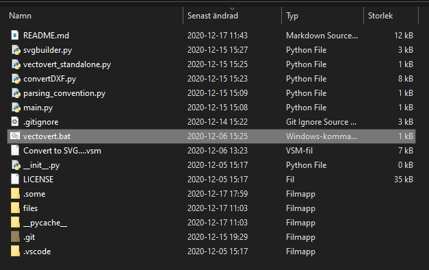
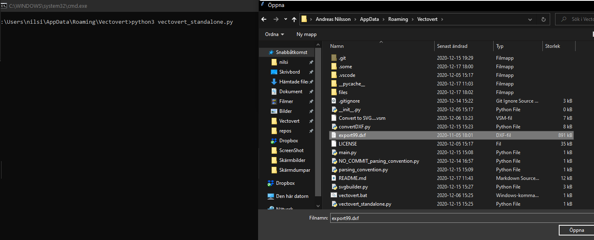
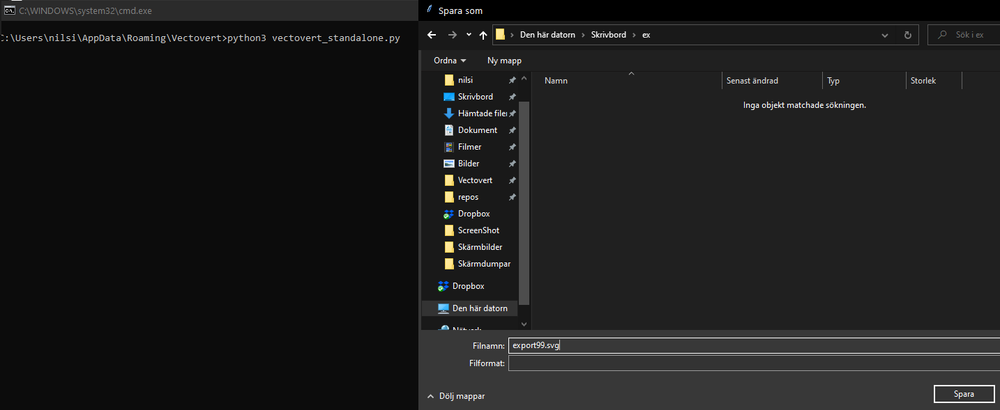
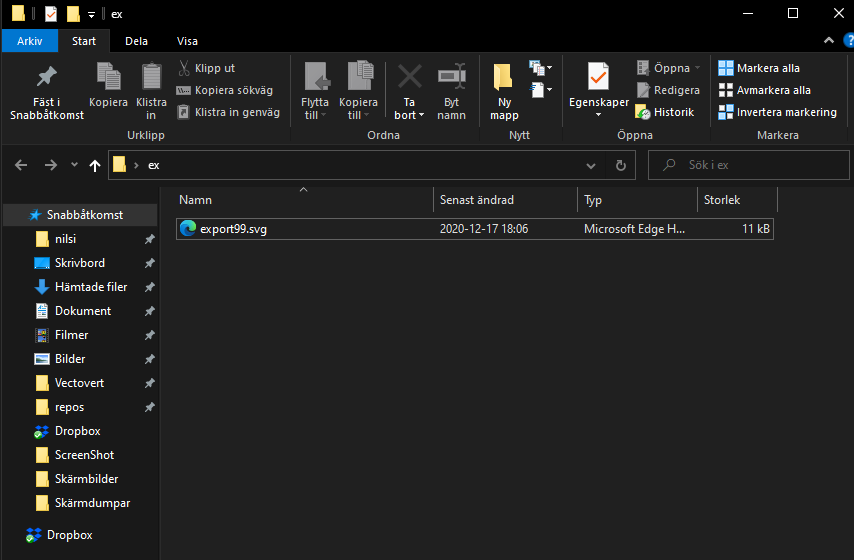

# Vectovert
## Table of Contents
* [Introduction](#introduction)
* [Dependencies](#dependencies)
* [Installation](#installation)
    * Standalone
    * Vectorworks 2021
* [Usage](#usage)
    * Standalone
    * Vectorworks 2021
    * Example: Running the script
* [Developer: General Plugin Design](#developer-general-plugin-design)
* [Known issues](#known-issues)

<br>
<br>
<br>

## Introduction
Vectovert is a Python script that converts DXF files to SVG files. The repository includes a plugin script for Vectorworks 2021 and a standalone script for use outside of the Vectorworks interface. 

Vectovert uses *ezdxf* and *svgwrite* to parse DXF files, convert graphical DXF entities to SVG elements, inject them with custom attributes and finally write them to a SVG file. 

<br>
<br>
<br>

## Dependencies
* **Python 3.6+** 
* **ezdxf** - *tested with version 0.14.2*
* **svgwrite** - *tested with version 1.4*

<br>
<br>
<br>

## Installation
### Standalone
Installing Vectovert as a standalone involves less steps than setting it up as a plugin for Vectorworks 2021. The steps are detailed below:

1. Download this repository from GitHub (https://github.com/Manisprani/Vectovert)
2. If your system doesn't have a Python installation of version 3.6 or newer, ensure you install one!
3. Install the script dependencies *ezdxf* and *svgwrite*, for instance using: `pip install ezdxf svgwrite`

<br>

### Vectorworks 2021
Installing Vectovert as a Vectorworks plugin consists of a few more steps. Since Vectorworks includes its own Python installation, installing the dependencies is not done manually. Instead, Marionette handles this through the .vsm script. The steps are categorized and detailed below:

#### Get and setup Vectovert
1. Download this repository from GitHub (https://github.com/Manisprani/Vectovert)
2. Put the .vsm script in the directory: `User\AppData\Roaming\Nemetschek\Vectorworks\2021\Plug-ins`
3. Go to Tools -> Plugins -> Script options in Vectorworks and add the downloaded Vectovert repository folder containing the `main.py` to the path.
4. Restart Vectorworks.

#### Add “Convert to SVG” to the export-menu.

1. Press Tools - Workspaces - Edit Current Workspace. Two panels Commands and Menu show up. 
2. Open Import/Export in the Commands panel.
3. Open Export under File in the Menus panel. 
4. Drag “Convert to SVG” from Commands and drop it under Export in Menus.
5. Press OK.

#### Install plugin dependencies

1. Navigate to and click File - Export - Convert to SVG. 
2. If this is the first time running the plugin, a command prompt will ask you to install the dependencies ezdxf and svgwrite. Press OK for both these prompts.
3. After these modules are installed, exit the plugin by pressing Cancel.
4. Restart VectorWorks. This ensures that the plugin doesn’t repeatedly ask you to install the dependencies.

<br>
<br>
<br>

## Usage
### Standalone
After ensuring your machine is running Python 3.6 or newer, and the module dependencies are installed, you can run the script through a command line as you would any Python script: `python3 vectovert_standalone.py`

Alternatively, use the provided file `vectovert.bat`, to run the command above.

<br>

### Vectorworks 2021
When the plugin has been added to the Import/Export menu, it is simply run by:

1. Navigating to the Import/Export menu and clicking Convert to SVG... 
2. A prompt will ask whether to convert the current working file, or whether to browse for an existing DXF.
3. After this, Vectorworks will prompt the user to export the file as a DXF.
4. Then, Vectorworks prompts the user to navigate to the exported DXF and choose it.
5. Finally, a prompt asks the user to start the conversion. 

Given the recursive nature of the plugin (and the size of some DWG files), the conversion might take a while!

<br>
<br>
<br>

### Example: Running the script

A use case running the script with the `vectovert.bat` is depicted below. Depending on if your Python path points to *python3* or *python*, you have to alter the bat-file accordingly. The default command in the .bat assumes *python3*.

_Step 1 - Run the vectovert.bat_



_Step 2 - Command prompt pops up. Choose a DXF file to convert!_



_Step 3 - Choose a destination for the SVG file._



_Step 4 - Conversion done!_



<br>
<br>
<br>

## Developer: General Plugin Design
The plugin uses Vectorworks built-in DXF export. The generated DXF file is then used as an intermediate file format for conversion to SVG using the Python module ezdxf. Using the Vectorworks API, the file path is chosen and given to the Python script. If the script can’t identify the file as a .DXF or deems the file corrupted, it stops executing.

When SVG conversion begins, all graphical entities in the DXF are iterated over. If it is a singular entity with no children, it is added to the SVG. However, if it is an INSERT (an entity with children entities) it is first added as a SVG group, then its children are iterated over and added to that group. This is done recursively, since INSERTs can contain other INSERTs, with their own children entities.

Every added group gets an attribute code and type assigned to it, signalling its code and component type. The script works on the assumption that the DWG entities follow the naming convention points below (parameters are set in `parsing_convention.py`):
* A component name starts a special character called `CONVERSION_MARKER`, for instance `&`
* The string following the conversion marker is the ID of the component. <br>
**Example:** A conveyor belt could have the following name: `&top.level.object`
* A component belonging to another component drops the last dot-separated part of that component’s ID, and adds a suffix that starts with a special character `COMPONENT_DIVIDER`, for instance `*`, followed by the component type and ID.<br>
**Example:** A motor belonging to the conveyor belt in the point example above could have the name `&top.level.object*MOTOR2`

In the generated SVG tags, the code attribute represents the components position - the part it belongs to, typically a conveyor. 

The component ID is parsed to determine what component type to put down the component as, according to the component ID list. This is currently configured in a dictionary `TYPES` found in [parsing_convention.py](parsing_convention.py).

So, if the motor `MOTOR2` is a part of the conveyor `&top.level.conv33`, its final SVG tag will be as follows: <br> 
``` 
<g id="&top.level.conv33*MOTOR2" code="&top.level.conv33" type="motor" />
``` 

<br>
<br>
<br>

## Functionality

Vectovert is currently capable of:

* Draw conveyor objects as fillable blocks
* Add (and optionally draw) components, used as status indicators for conveyor blocks
* Automatically set the SVG viewbox so it fits the DWG file.

<br>
<br>
<br>

## Known issues
### Symbol scaling and rotation
 
The SVG conversion does not currently support object rotation and scaling. 
 
Currently, the DXF entities are translated from their respective Object Coordinate System (OCS) to the World Coordinate System (WCS) using the utilities found in **ezdxf**. Tests have shown that converting OCS to WCS using said module does not consistently apply necessary transformations to drawn graphical entities.
 
In the time frame of our development, implementing rotation support fell out of scope. A possible solution to this would be accessing the `ezdxf.entities.Insert.dxf.rotation` attribute when adding the SVG group tag, and transforming the group using the attribute values.
 
Implementing scaling support was initially planned, but got perpetually delayed because of its difficulty. Analysis showed that scaled INSERT entities had their attributes `ezdxf.entities.Insert.dxf.xscale` and `ezdxf.entities.Insert.dxf.yscale` modified. The project group attempted to take this into consideration by moving the object to the world origin, scaling it according to `xscale` and `yscale`, and then translating the object back to its intended location. This did not show intended behaviour, and objects were instead drawn outside of the SVG viewbox, or ended up at otherwise undefined locations.
 
The project group also tried solving the scaling issue using the method `ezdxf.entities.Insert.explode()`. The method description in the **ezdxf** documentation made it into a prime candidate for solving the problem, but our tests did not yield the expected results - much like the method mentioned earlier using xscale and yscale.
 
Scaling support is definitely a possible addition to the project using **ezdxf**. Further testing regarding `ezdxf.entities.Insert.explode()`, OCS-to-WCS conversion and the interaction between the two might be the key to developing correct scaling functionality in the script.

<br>
<br>

### Nested INSERT Symbols
 
Nesting components are not supported. Conveyors and components belonging to these are assumed to exist on the top layer of the DWG.
 
Modelled after a reference file, the first call to the conversion adds INSERT entities as group tags in the SVG. These are the components, and are thus assumed to not be nested in each other. Every subsequent call to the recursive conversion simply keeps iterating over and enters the nested INSERT entities without adding these entities as group tags.
 
If support for nested components is desirable, moving the group tag-creation functionality to the recursive method when an INSERT entity is found would be a good start.

<br>
<br>

 
### Fillable objects
 
Not all SVG elements in the output file are fillable. The base case for the recursive conversion ends up in a choice between converting different graphical DXF entities such as lines, circles, etc. 
 
This is a primitive way of converting the DXF to SVG graphics and initially all conversion was done using this somewhat brute-forced graphical conversion. Since the targeted SCADA software expects to set the fill attribute of SVG tags, solely utilizing this method is not enough to create a workable SVG. 

Instead, as it currently stands, fillable blocks can be created using a specific method, where the entity is transformed into a closed, rectangular and fillable element in the SVG file. For now the only support is for completely vertical or horizontal blocks and the component type is hardcoded as `conveyor`. Since the method in its current state only checks the coordinate extents of a conveyor block, it can only create rectangular, non-rotated blocks. As a result, arcs and rotated conveyors cannot be converted to fillable objects.

Extending the dictionary in parsing_convention.py with a flag that signals whether the entity should be hard converted or converted as a fillable block would make the conversion more flexible. One could also use the `convert_conveyor_block()` method as a template for designing (for instance) similar entities that are to be represented as circles. Refining the `convert_conveyor_block()` to create more advanced shapes is also definitely a possibility - the  **ezdxf** module supports the acquisition of necessary DXF attributes the **svgwrite** module is capable of creating intricate SVG elements, using the aforementioned attributes.

### Vertically flipped SVG files

Tests have shown that some SVG viewers show the SVG image flipped along the Y axis. During our conversion, we flip the whole SVG vertically by adding the attribute `transform=scale(1,-1)` to the main SVG tag. It seems that not all viewers take this attribute into consideration. Viewers such as Google Chrome, Mozilla Firefox and Microsoft Edge show the SVG correctly, but Inkscape and Safari Explorer do not. It remains to be tested if the targeted SCADA software can take the transform attribute into consideration or not.